# Core Concepts

## Overview

This document provides deep dives into core LangChain concepts covered throughout the 12 exercises.

---

## 1. Language Models (LLMs)

### What Are Language Models?

Language Models are neural networks trained on vast amounts of text that can:
- Understand and process natural language
- Generate coherent text responses
- Follow instructions
- Perform reasoning tasks

### Model Initialization

```python
from langchain import init_chat_model

# Initialize a model
model = init_chat_model("openai/gpt-4-turbo")
```

### Different Invocation Modes

```python
# Single request
response = model.invoke("What is LangChain?")

# Stream tokens
for chunk in model.stream("Hello"):
    print(chunk.content, end="", flush=True)

# Multiple requests (batch)
responses = model.batch(["Question 1", "Question 2", "Question 3"])
```

### Model Parameters

- **Temperature** (0.0-2.0): Controls randomness
  - 0.0: Deterministic, same answer every time
  - 1.0: Balanced randomness
  - 2.0: Very creative, unpredictable
  
- **max_tokens**: Maximum length of response
  
- **top_p**: Controls diversity via nucleus sampling

- **frequency_penalty**: Discourages repetition

---

## 2. Messages

### Message Types

Messages are the fundamental data structure in LangChain:

```python
from langchain_core.messages import (
    SystemMessage,      # Define assistant behavior
    HumanMessage,       # User/human input
    AIMessage,          # Assistant/AI response
    ToolMessage,        # Tool execution result
)

# System message sets the tone
system = SystemMessage("You are a helpful assistant.")

# Human message is user input
user = HumanMessage("What is the capital of France?")

# AI message is model response
assistant = AIMessage("The capital of France is Paris.")

# Tool message is tool execution result
tool_result = ToolMessage("Weather in Paris: 72°F")
```

### Conversation History

Conversations are just lists of messages:

```python
from langchain_core.messages import HumanMessage, AIMessage, SystemMessage

conversation = [
    SystemMessage("You are a helpful assistant."),
    HumanMessage("What is 2 + 2?"),
    AIMessage("2 + 2 equals 4."),
    HumanMessage("What about 3 + 3?"),
    AIMessage("3 + 3 equals 6."),
]

# Pass to model for continuation
response = model.invoke(conversation + [HumanMessage("And 4 + 4?")])
```

### Message Roles

Each message type has a specific role:
- **System**: Defines assistant personality
- **Human**: User queries and instructions
- **AI**: Model responses and reasoning
- **Tool**: Tool execution results

---

## 3. Tools

### What Are Tools?

Tools are functions that agents can call to interact with external systems:

```python
from langchain_core.tools import tool

@tool
def get_weather(location: str) -> str:
    """Get the current weather for a location.
    
    Args:
        location: City name
        
    Returns:
        Weather description
    """
    return f"The weather in {location} is sunny and 72°F"

@tool
def calculate(expression: str) -> float:
    """Evaluate a mathematical expression."""
    return eval(expression)
```

### Tool Schemas

Tools generate JSON schemas automatically:

```python
from langchain_core.tools import tool

@tool
def my_tool(param1: str, param2: int) -> str:
    """Tool description.
    
    Args:
        param1: Parameter 1 description
        param2: Parameter 2 description
        
    Returns:
        Return value description
    """
    return f"Result: {param1} {param2}"

# Schema is auto-generated from type hints
# Tools can be introspected programmatically
```

### Tool Organization

```python
# Create a registry of tools
tools = [calculator, weather, search]

# Make them available to agents
agent = create_agent(model, tools)
```

---

## 4. Agents

### ReAct Pattern

The ReAct (Reasoning + Acting) pattern is how agents solve problems:

```mermaid
flowchart TD
    A["🤔 Thought: What do I need to do?"] --> B["⚙️ Action: Call tool X with parameters"]
    B --> C["📊 Tool X executes and returns result"]
    C --> D["👀 Observation: Tool result was..."] 
    D --> E{"Need more info?"}
    E -->|Yes| F["🤔 Continue thinking"] --> B
    E -->|No| G["✅ Final Answer"]
```



### Agent Loop

```python
# Create agent
agent = create_agent(model, tools)

# Invoke with message
response = agent.invoke({"messages": [HumanMessage("...")]})

# Agent handles:
# 1. Deciding which tool to use
# 2. Calling the tool
# 3. Processing results
# 4. Deciding next step
# 5. Repeating until answer found
```

---

## 5. Streaming

### Why Stream?

- Provides real-time feedback
- Better user experience
- Useful for long-running operations
- Shows model is working

### Streaming Implementation

```python
# Stream individual tokens
for chunk in model.stream("Hello world"):
    print(chunk.content, end="", flush=True)

# Collect complete response
complete = ""
for chunk in model.stream(prompt):
    complete += chunk.content
```

### Event Streaming

```python
# Agents can emit detailed events
events = agent.stream({"messages": [...]})

for event in events:
    if event.get("type") == "ai":
        print("Agent thinking:", event["content"])
    elif event.get("type") == "tool":
        print("Agent using tool:", event["tool"])
    elif event.get("type") == "result":
        print("Tool result:", event["output"])
```

---

## 6. Structured Output

### Why Structured Output?

Normal LLM output is unpredictable text. Structured output guarantees a specific format:

```python
from pydantic import BaseModel, Field

class Person(BaseModel):
    name: str = Field(description="Person's full name")
    age: int = Field(description="Age in years", ge=0, le=150)
    email: str = Field(description="Email address")

# Get guaranteed structured output
result = model.with_structured_output(Person).invoke(prompt)
# result is a Person instance, not raw text
```

### Validation

```python
# Pydantic validates output automatically
try:
    result = model.with_structured_output(Person).invoke(prompt)
    # result is guaranteed valid
except ValidationError as e:
    # Model output didn't match schema
    print(f"Invalid output: {e}")
```

---

## 7. Prompts & Prompt Engineering

### System Prompts

System prompts define assistant behavior:

```python
system_prompt = """You are a helpful math tutor. 
- Explain concepts clearly
- Show step-by-step solutions
- Encourage the student"""

messages = [
    SystemMessage(system_prompt),
    HumanMessage("How do I solve quadratic equations?"),
]

response = model.invoke(messages)
```

### Chain of Thought

Encouraging step-by-step reasoning improves results:

```python
prompt = """
Let's think through this step-by-step:

Question: {question}

Please think through this carefully:
1. Identify the key information
2. Break down the problem
3. Work through each part
4. Provide the final answer
"""
```

### Dynamic Prompts

```python
from string import Template

template = Template("""
You are an expert in $domain.
Answer the following question:
$question
""")

prompt = template.substitute(
    domain="machine learning",
    question="What is backpropagation?"
)
```

---

## 8. Middleware

### Middleware Architecture

Middleware intercepts execution to add behavior:

```mermaid
flowchart TD
    A["👤 User Input"] --> B["🔍 Before Middleware<br/>Validate, Log, Modify"]
    B --> C["🧠 Model/Agent<br/>Core Execution"]
    C --> D["✅ After Middleware<br/>Validate, Log, Cache"]
    D --> E["📄 User Output"]
    
    style A fill:#e1f5ff
    style B fill:#fff3e0
    style C fill:#f3e5f5
    style D fill:#e8f5e9
    style E fill:#e1f5ff
```



### Custom Middleware

```python
class LoggingMiddleware:
    def before_execution(self, inputs):
        print(f"Inputs: {inputs}")
        return inputs
    
    def after_execution(self, outputs):
        print(f"Outputs: {outputs}")
        return outputs
```

---

## 9. Memory & State

### Short-term Memory (Conversation History)

```python
# Keep recent messages for context
recent_messages = [
    SystemMessage("You are helpful"),
    HumanMessage("What is Python?"),
    AIMessage("Python is..."),
    HumanMessage("Tell me more"),  # Agent remembers previous
]

response = model.invoke(recent_messages)
```

### Long-term Memory (Persistent Storage)

```python
# Store important facts
memory = {
    "user_preferences": {"language": "python"},
    "past_conversations": ["...", "..."],
    "user_info": {"name": "Alice"}
}

# Retrieve for context
context = memory.get("user_preferences")
```

### State Checkpoints

```python
# Save state at key points
checkpoint = {
    "messages": current_messages,
    "tools_used": tools_called,
    "timestamp": datetime.now(),
}

# Can restore later
restored_state = load_checkpoint(checkpoint_id)
```

---

## 10. Error Handling

### Tool Errors

```python
def execute_tool_safely(tool, input_data):
    try:
        return tool.invoke(input_data)
    except ValueError as e:
        return f"Invalid input: {e}"
    except Exception as e:
        return f"Tool error: {e}"
```

### Retry Logic

```python
def retry_with_backoff(func, max_retries=3):
    for attempt in range(max_retries):
        try:
            return func()
        except Exception as e:
            wait_time = 2 ** attempt  # Exponential backoff
            if attempt < max_retries - 1:
                time.sleep(wait_time)
            else:
                raise
```

---

## 11. Multi-Agent Systems

### Supervisor Pattern

```mermaid
graph TD
    A["👨‍💼 Supervisor<br/>Decides which worker to use"]
    B["🧮 Worker 1<br/>Math"]
    C["✏️ Worker 2<br/>Writing"]
    D["💻 Worker 3<br/>Coding"]
    
    A --> B
    A --> C
    A --> D
    
    style A fill:#ffebee
    style B fill:#e3f2fd
    style C fill:#f3e5f5
    style D fill:#e8f5e9
```



### Message Passing

```python
# Agents communicate through messages
supervisor_message = {
    "recipient": "calculator_agent",
    "task": "Calculate 2 + 2",
    "context": {...}
}

# Worker processes and responds
worker_response = {
    "sender": "calculator_agent",
    "result": 4,
    "success": True
}
```

---

## Summary of Concepts

| Concept | Purpose | Key Insight |
|---------|---------|-------------|
| **Models** | Generate text | Different models behave differently |
| **Messages** | Communicate | Conversations are message lists |
| **Tools** | External actions | Models can't compute, only agents can |
| **Agents** | Autonomous solving | ReAct: Think → Act → Observe |
| **Streaming** | Real-time feedback | Show progress, not just results |
| **Structured Output** | Reliable parsing | Guarantee format, not guess it |
| **Prompts** | Guide behavior | Good prompts improve results |
| **Middleware** | Customize behavior | Intercept and modify execution |
| **Memory** | Context awareness | Remember past for better future |
| **Error Handling** | Robustness | Plan for failures |
| **Multi-Agent** | Complex solving | Specialized agents for tasks |

---

## Resources for Deeper Learning

- **LangChain Docs**: https://docs.langchain.com
- **ReAct Paper**: https://arxiv.org/abs/2210.03629
- **Prompt Engineering**: https://platform.openai.com/docs/guides/prompt-engineering
- **Pydantic**: https://docs.pydantic.dev

