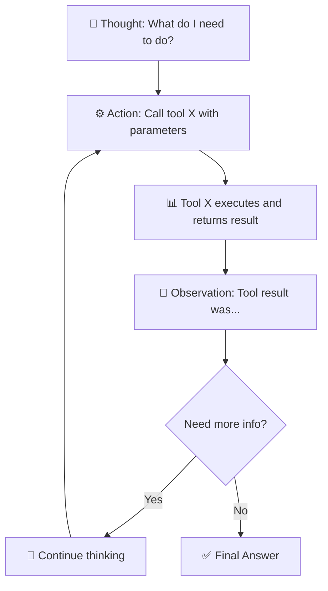

# Concept Guide: Basic Agents

## Key Concepts

1. **ReAct: Reason + Act** - Agent thinks, then chooses an action (often a tool call)
2. **Loop until done** - Think → Act → Observe → repeat or answer
3. **Agents use tools** - They can't compute; tools provide external capabilities
4. **State is messages** - Input and output are message lists

## Visual: ReAct Pattern



## Agent Loop (Text)

```
┌─────────────────────────────────────────────────────────────┐
│                      AGENT LOOP                              │
├─────────────────────────────────────────────────────────────┤
│                                                              │
│   User: "What's the weather in Paris and is it good for      │
│          a picnic?"                                          │
│        │                                                     │
│        ▼                                                     │
│   Agent: Thought → I need weather. Action → get_weather(Paris)│
│        │                                                     │
│        ▼                                                     │
│   Tool returns: "72°F, sunny"                                │
│        │                                                     │
│        ▼                                                     │
│   Agent: Thought → I have the data. Answer → "Yes, 72°F      │
│          and sunny is great for a picnic."                   │
│                                                              │
└─────────────────────────────────────────────────────────────┘
```

## Code Example

```python
# Create agent with model and tools
agent = create_agent(model, tools)

# Invoke with message
response = agent.invoke({"messages": [HumanMessage("What's the weather in Tokyo?")]})

# Agent handles:
# 1. Deciding which tool to use
# 2. Calling the tool
# 3. Processing results
# 4. Deciding next step
# 5. Repeating until answer found
```

## Teach-Back

Explain in your own words:
1. What is the "Observe" step in ReAct?
2. When would an agent call more than one tool?
3. Why can't the model just "know" the weather without a tool?
