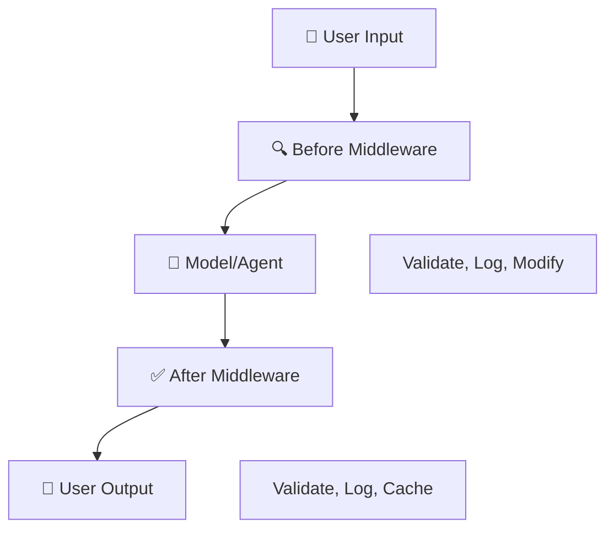

# Concept Guide: Middleware

## Key Concepts

1. **Middleware wraps execution** - Runs before and after the core call
2. **Use for cross-cutting concerns** - Logging, validation, caching, metrics
3. **Modify inputs/outputs** - Sanitize, enrich, or transform
4. **Composable** - Chain multiple middleware layers

## Visual: Middleware Architecture



## Text Diagram

```
┌─────────────────────────────────────────────────────────────┐
│                 MIDDLEWARE PIPELINE                          │
├─────────────────────────────────────────────────────────────┤
│                                                              │
│   Input → [Before: validate, log, modify] → Model/Agent     │
│              → [After: validate, log, cache] → Output       │
│                                                              │
│   Each middleware can:                                       │
│   • Inspect and change inputs                                │
│   • Inspect and change outputs                               │
│   • Short-circuit (e.g. return cached result)                │
│                                                              │
└─────────────────────────────────────────────────────────────┘
```

## Code Example

```python
class LoggingMiddleware:
    def before_execution(self, inputs):
        print(f"Inputs: {inputs}")
        return inputs

    def after_execution(self, outputs):
        print(f"Outputs: {outputs}")
        return outputs
```

## Teach-Back

Explain in your own words:
1. What kinds of things would you do in before_execution?
2. When might after_execution modify the output?
3. How could middleware implement response caching?
