# Concept Guide: Advanced Workflows

## Key Concepts

1. **Multi-agent = multiple specialized agents** - Each does one thing well
2. **Supervisor pattern** - One agent routes tasks to worker agents
3. **Message passing** - Agents communicate via structured messages (recipient, task, result)
4. **Use for complex tasks** - Research, coding + review, multi-step planning

## Visual: Supervisor Pattern

```mermaid
graph TD
    A["👨‍💼 Supervisor"]
    B["🧮 Worker: Math"]
    C["✏️ Worker: Writing"]
    D["💻 Worker: Coding"]
    A --> B
    A --> C
    A --> D
```



## Text Diagram

```
┌─────────────────────────────────────────────────────────────┐
│                 MULTI-AGENT WORKFLOW                         │
├─────────────────────────────────────────────────────────────┤
│                                                              │
│   User task: "Research X, write a summary, and add code."    │
│        │                                                     │
│        ▼                                                     │
│   Supervisor: Decides order and which worker for each step   │
│        │                                                     │
│        ├──▶ Worker 1 (research) → facts                      │
│        ├──▶ Worker 2 (writing)  → summary                    │
│        └──▶ Worker 3 (coding)   → code snippet               │
│        │                                                     │
│        ▼                                                     │
│   Supervisor: Combines results → final answer                │
│                                                              │
└─────────────────────────────────────────────────────────────┘
```

## Code Example

```python
# Agents communicate through messages
supervisor_message = {
    "recipient": "calculator_agent",
    "task": "Calculate 2 + 2",
    "context": {...},
}

# Worker processes and responds
worker_response = {
    "sender": "calculator_agent",
    "result": 4,
    "success": True,
}
```

## Teach-Back

Explain in your own words:
1. When would you use a supervisor instead of one agent with many tools?
2. What does the supervisor need to know about each worker?
3. How could message passing support a "research then write" workflow?
